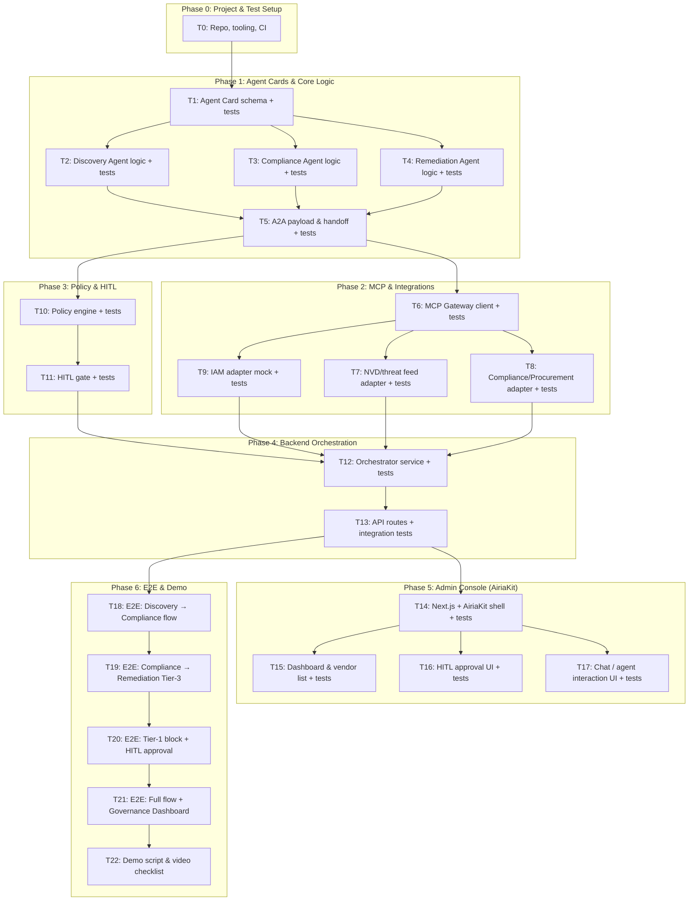

# TrustGrid Implementation Plan

> **For Claude:** REQUIRED SUB-SKILL: Use superpowers:executing-plans to implement this plan task-by-task.

**Goal:** Deliver an autonomous, continuous vendor risk and compliance orchestration platform (TrustGrid) for the Airia AI Agents Hackathon (Track 2: Active Agents), with three specialized agents (Discovery, Compliance Audit, Remediation), A2A handoffs, MCP Gateway integrations, and Human-in-the-Loop (HITL) governance—fully test-driven with unit, integration, and E2E tests.

**Architecture:** React/Next.js + AiriaKit admin console; Airia Agent Builder for three agents; A2A protocol via `/.well-known/agent.json` Agent Cards; all external telemetry via Airia MCP Gateway (OAuth/SSO); policy engine enforcing HITL for Tier-1 vendor actions. TDD: red → green → refactor per task; tests written first, then minimal implementation.

**Tech Stack:** Next.js, React, Airia SDK / AiriaKit, Airia Agent Builder, A2A (Agent Cards), Airia MCP Gateway, NVD API / threat feeds (via MCP), Jira/ServiceNow and Entra/Okta mocks (via MCP), Jest/Vitest (unit/integration), Playwright (E2E).

**Hackathon alignment:** Track 2 (Active Agents); judging: Quality of Idea, Potential Impact, Design, Technological Implementation; submission: agent name, description, 4-min demo video, Airia Community publish.

---

## Dependency Graph (DAG)

Tasks are numbered; arrows indicate “must complete before.” Each task follows TDD: write failing test → verify fail → minimal implementation → verify pass → commit.



**DAG summary (read order for execution):**

- **T0** → **T1** → **T2, T3, T4** (parallel after T1) → **T5** → **T6** → **T7, T8, T9** (parallel after T6) → **T10** → **T11** → **T12** → **T13** → **T14** → **T15, T16, T17** (parallel after T14) → **T18** → **T19** → **T20** → **T21** → **T22**.

**Textual DAG (dependencies only):**

```
T0
└── T1
    └── T2 ──┐
    └── T3 ──┼── T5 ── T6 ──┬── T7 ──┐
    └── T4 ──┘              ├── T8 ──┼── T12 ── T13 ──┬── T14 ──┬── T15 ──┐
                            └── T9 ──┘               │         ├── T16 ──┼── T18 ── T19 ── T20 ── T21 ── T22
T5 ──────────────────────────────── T10 ── T11 ──────┘         └── T17 ──┘
```

**Hackathon judging criteria → plan mapping:**

| Criterion | How the plan addresses it |
|-----------|---------------------------|
| **Quality of Idea** | PRD problem/solution; T2–T5 (triad of agents, A2A); T10–T11 (policy + HITL). Demo script (T22) articulates uniqueness. |
| **Potential Impact** | PRD value (vendor risk, compliance); demo script “enterprise value” (T22); README and submission description. |
| **Design** | T14–T17 (Admin Console, AiriaKit, dashboard, HITL UI, chat); balanced frontend (React/Next.js/AiriaKit) and backend (orchestrator, API, agents). |
| **Technological Implementation** | T1 (Agent Cards), T5 (A2A), T6 (MCP Gateway), T10–T11 (constraints/HITL), Airia Agent Builder usage; T0–T21 ensure quality via TDD and tests. |

**Required submission checklist (from hackathon):**

- [ ] Agent name: TrustGrid (or final name) in DevPost and Airia Community.
- [ ] Project description: target users, technologies, key features, solution overview, problem statement.
- [ ] Demo video: ≤4 min, narration/captions, real-time agent demo, YouTube/Vimeo.
- [ ] Airia Community: agent published, Public visibility, Community URL in DevPost.

---

## Phase 0: Project & Test Setup

### Task T0: Repository, tooling, and CI

**Goal:** Monorepo with Next.js app, shared types, test runners (Jest/Vitest + Playwright), lint/format, and CI that runs unit + integration + E2E.

**Files:**

- Create: `package.json`, `tsconfig.json`, `.eslintrc.js`, `.prettierrc`, `vitest.config.ts`, `playwright.config.ts`, `.github/workflows/ci.yml`
- Create: `apps/web/` (Next.js app), `packages/shared/` (types, constants), `apps/web/package.json`, `apps/web/next.config.js`
- Create: `docs/plans/2026-02-26-trustgrid-implementation-plan.md` (this file)

**TDD steps:**

1. **Write failing “smoke” test:** Add `tests/smoke/ci.test.ts`: `expect(process.env.CI).toBeDefined()` or a trivial `sum(1,1) === 2` in a small `src/utils/sum.ts` and test it. Run test; expect pass only after implementation.
2. **Verify fail (optional for T0):** If test is “CI env present,” it may pass in CI; use a test that fails until `sum` exists.
3. **Implement:** Add `packages/shared/src/utils/sum.ts` with `export function sum(a: number, b: number) { return a + b; }`. Add `packages/shared/src/utils/sum.test.ts` with failing test first, then implementation (strict TDD for this one unit).
4. **Verify:** Run `pnpm test` or `npm test` from repo root; all tests pass.
5. **Commit:** `chore: project setup, shared package, vitest, playwright, CI`

**Commands:**

- `pnpm install` (or npm)
- `pnpm test` → unit/integration
- `pnpm run test:e2e` → Playwright
- `pnpm run lint`

**Deliverables:** Repo builds, tests run in CI, Playwright installed and runnable.

---

## Phase 1: Agent Cards & Core Logic

### Task T1: Agent Card schema and validation (TDD)

**Goal:** Define and validate JSON Agent Card schema (`/.well-known/agent.json`) for Discovery, Compliance, and Remediation agents per A2A; all behavior covered by tests.

**Files:**

- Create: `packages/shared/src/agent-card/schema.ts`
- Create: `packages/shared/src/agent-card/validate.ts`
- Create: `packages/shared/src/agent-card/index.ts`
- Create: `packages/shared/src/agent-card/__tests__/schema.test.ts`
- Create: `packages/shared/src/agent-card/__tests__/validate.test.ts`

**TDD steps (repeat per behavior):**

1. **Write failing test:** e.g. `validateAgentCard({})` throws or returns `{ valid: false, errors: [...] }`.
2. **Run test:** `pnpm test packages/shared/src/agent-card` → FAIL.
3. **Minimal implementation:** Implement validation in `validate.ts` and schema types in `schema.ts`.
4. **Run test:** PASS.
5. **Commit:** `feat(agent-card): schema and validation with tests`

**Test cases to cover:**

- Valid Discovery agent card (name, endpoint, capabilities, schema version).
- Valid Compliance and Remediation agent cards.
- Invalid: missing required fields, wrong types, invalid URL for endpoint.
- Schema export matches Airia/Agent Card expectations (reference Airia API docs).

**Deliverables:** Typed Agent Card schema, validation function, 100% test coverage for schema/validate.

---

### Task T2: Discovery Agent core logic (TDD)

**Goal:** Discovery Agent “logic” in process: given inputs (e.g. last run time, config), output a list of “findings” (e.g. CVE id, source, severity). No I/O in unit tests; use dependency injection for MCP/fetchers later.

**Files:**

- Create: `packages/agents/src/discovery/types.ts`
- Create: `packages/agents/src/discovery/run.ts` (or `discovery-agent.ts`)
- Create: `packages/agents/src/discovery/__tests__/run.test.ts`

**TDD steps:**

1. **Write failing test:** e.g. `runDiscovery({}, mockFetcher)` returns `{ findings: [] }` when fetcher returns empty; when fetcher returns one CVE, `findings.length === 1` and contains expected fields.
2. **Verify fail:** Run tests → FAIL (no `runDiscovery` or wrong shape).
3. **Minimal implementation:** Implement `runDiscovery` with interfaces for fetcher; return normalized findings.
4. **Verify pass:** All discovery tests pass.
5. **Commit:** `feat(discovery): core discovery agent logic with tests`

**Deliverables:** Discovery agent function with clear input/output interface and unit tests; no real HTTP yet.

---

### Task T3: Compliance Audit Agent core logic (TDD)

**Goal:** Compliance Agent: input = finding + vendor context + regulatory context; output = compliance assessment (e.g. “EU_AI_ACT”, “ISO_42001”, violated or not, summary). Pure logic testable with mocks.

**Files:**

- Create: `packages/agents/src/compliance/types.ts`
- Create: `packages/agents/src/compliance/run.ts`
- Create: `packages/agents/src/compliance/__tests__/run.test.ts`

**TDD steps:**

1. **Write failing test:** e.g. `runComplianceAudit(finding, vendorProfile, regulations)` returns `{ assessments: [...], reportSummary: "..." }` with expected structure.
2. **Verify fail** → **Implement** → **Verify pass** → **Commit:** `feat(compliance): compliance audit agent logic with tests`

**Deliverables:** Compliance assessment function and unit tests.

---

### Task T4: Remediation Action Agent core logic (TDD)

**Goal:** Remediation Agent: input = assessment + policy (tier, HITL required); output = recommended action (e.g. “quarantine” or “sever”) and whether action is allowed without HITL (Tier-3 yes, Tier-1 no). No real IAM calls in unit tests.

**Files:**

- Create: `packages/agents/src/remediation/types.ts`
- Create: `packages/agents/src/remediation/run.ts`
- Create: `packages/agents/src/remediation/__tests__/run.test.ts`

**TDD steps:**

1. **Write failing test:** Tier-3 → allowed auto action; Tier-1 → action blocked, requires HITL.
2. **Verify fail** → **Implement** → **Verify pass** → **Commit:** `feat(remediation): remediation agent logic with tests`

**Deliverables:** Remediation decision logic and unit tests.

---

### Task T5: A2A payload and handoff (TDD)

**Goal:** Define A2A payload format (Discovery → Compliance, Compliance → Remediation); serialization/deserialization and handoff validation; all covered by tests.

**Files:**

- Create: `packages/shared/src/a2a/payload.ts`
- Create: `packages/shared/src/a2a/handoff.ts`
- Create: `packages/shared/src/a2a/__tests__/payload.test.ts`
- Create: `packages/shared/src/a2a/__tests__/handoff.test.ts`

**TDD steps:**

1. **Write failing test:** `encodeDiscoveryToCompliancePayload(finding)` produces object with required fields; `decodeCompliancePayload(encoded)` round-trips; handoff validation rejects tampered or missing fields.
2. **Verify fail** → **Implement** → **Verify pass** → **Commit:** `feat(a2a): payload encoding and handoff validation with tests`

**Deliverables:** A2A payload types, encode/decode, handoff validation, unit tests.

---

## Phase 2: MCP & Integrations

### Task T6: MCP Gateway client (TDD)

**Goal:** Thin client or adapter that “calls” Airia MCP Gateway (OAuth/SSO). For unit tests, use mock/fake; for integration tests, use test harness or stub server.

**Files:**

- Create: `packages/integrations/src/mcp-client/types.ts`
- Create: `packages/integrations/src/mcp-client/client.ts`
- Create: `packages/integrations/src/mcp-client/__tests__/client.test.ts`
- Create (optional): `packages/integrations/src/mcp-client/__tests__/client.integration.test.ts`

**TDD steps:**

1. **Write failing test:** Client method `listTools()` returns array of tool descriptors when mock gateway responds; auth token is passed in headers.
2. **Verify fail** → **Implement** (fetch or SDK call to gateway endpoint with token) → **Verify pass** → **Commit:** `feat(mcp): MCP Gateway client with tests`

**Deliverables:** MCP client with unit tests; optional integration test against stub.

---

### Task T7: NVD / threat feed adapter (TDD)

**Goal:** Adapter that uses MCP (via T6 client) to fetch NVD/threat data; normalize to “finding” shape consumed by Discovery agent. Unit test with mocked MCP client.

**Files:**

- Create: `packages/integrations/src/feeds/nvd-adapter.ts`
- Create: `packages/integrations/src/feeds/__tests__/nvd-adapter.test.ts`

**TDD steps:**

1. **Write failing test:** When MCP returns NVD-like response, adapter returns `Finding[]` with expected fields (id, severity, source).
2. **Verify fail** → **Implement** → **Verify pass** → **Commit:** `feat(integrations): NVD/threat feed adapter with tests`

**Deliverables:** NVD adapter and unit tests; integration test optional (stub MCP).

---

### Task T8: Compliance / procurement adapter (TDD)

**Goal:** Adapter that uses MCP to query “vendor compliance portal” or “procurement DB” (Jira/ServiceNow mock); returns vendor profile and stated posture. Unit test with mocked MCP.

**Files:**

- Create: `packages/integrations/src/compliance/procurement-adapter.ts`
- Create: `packages/integrations/src/compliance/__tests__/procurement-adapter.test.ts`

**TDD steps:**

1. **Write failing test:** Mock MCP response → adapter returns vendor profile (tier, regulations, etc.).
2. **Verify fail** → **Implement** → **Verify pass** → **Commit:** `feat(integrations): compliance/procurement adapter with tests`

**Deliverables:** Procurement/compliance adapter and unit tests.

---

### Task T9: IAM adapter mock (TDD)

**Goal:** Adapter interface for “sever connection” / “quarantine” actions; implementation that in demo is a mock (no real Entra/Okta). Unit tests verify “call” with tier and HITL flag results in correct mock behavior (e.g. Tier-1 without approval → no-op or error).

**Files:**

- Create: `packages/integrations/src/iam/iam-adapter.ts`
- Create: `packages/integrations/src/iam/__tests__/iam-adapter.test.ts`

**TDD steps:**

1. **Write failing test:** `severConnection(vendorId, { tier: 1, hitlApproved: false })` throws or returns `{ blocked: true }`; with `hitlApproved: true` returns `{ success: true }`.
2. **Verify fail** → **Implement** → **Verify pass** → **Commit:** `feat(integrations): IAM adapter mock with tests`

**Deliverables:** IAM adapter interface and mock implementation with unit tests.

---

## Phase 3: Policy & HITL

### Task T10: Policy engine (TDD)

**Goal:** Policy engine: given vendor tier and action type, returns whether action is allowed automatically or requires HITL. Encodes “Tier-1 → HITL required; Tier-3 → auto allowed” (per PRD).

**Files:**

- Create: `packages/shared/src/policy/engine.ts`
- Create: `packages/shared/src/policy/__tests__/engine.test.ts`

**TDD steps:**

1. **Write failing test:** `evaluatePolicy({ vendorTier: 1, action: "sever" })` → `{ allowed: false, requiresHitl: true }`; tier 3 → `{ allowed: true, requiresHitl: false }`.
2. **Verify fail** → **Implement** → **Verify pass** → **Commit:** `feat(policy): policy engine with tests`

**Deliverables:** Policy evaluation and unit tests.

---

### Task T11: HITL gate (TDD)

**Goal:** HITL gate: given pending action and human approval token/signal, either executes remediation (e.g. calls IAM adapter) or rejects. Unit tests with mocked IAM and approval store.

**Files:**

- Create: `packages/shared/src/hitl/gate.ts`
- Create: `packages/shared/src/hitl/__tests__/gate.test.ts`

**TDD steps:**

1. **Write failing test:** Execute with valid approval → IAM adapter called; execute without approval for Tier-1 → not called / error.
2. **Verify fail** → **Implement** → **Verify pass** → **Commit:** `feat(hitl): HITL gate with tests`

**Deliverables:** HITL gate and unit tests.

---

## Phase 4: Backend Orchestration

### Task T12: Orchestrator service (TDD)

**Goal:** Orchestrator that wires Discovery → Compliance → Remediation: run discovery, for each finding run compliance, then run remediation; apply policy and HITL gate; persist pending actions for dashboard. Unit tests with mocked adapters; integration test optional (full flow with mocks).

**Files:**

- Create: `apps/api/src/orchestrator/service.ts` (or `packages/orchestrator/src/service.ts`)
- Create: `apps/api/src/orchestrator/__tests__/service.test.ts`
- Create (optional): `apps/api/src/orchestrator/__tests__/service.integration.test.ts`

**TDD steps:**

1. **Write failing test:** One finding → one compliance run → one remediation decision; Tier-1 → pending action created, no IAM call; Tier-3 → IAM mock called.
2. **Verify fail** → **Implement** → **Verify pass** → **Commit:** `feat(orchestrator): orchestrator service with tests`

**Deliverables:** Orchestrator service, unit tests, optional integration test.

---

### Task T13: API routes and integration tests

**Goal:** Next.js API routes (or separate Express/Fastify) for: trigger orchestration run, list pending HITL actions, approve/reject HITL. Integration tests that call HTTP endpoints with test DB/mocks.

**Files:**

- Create: `apps/web/src/app/api/orchestrate/route.ts`, `apps/web/src/app/api/pending-actions/route.ts`, `apps/web/src/app/api/hitl/approve/route.ts`
- Create: `apps/web/src/app/api/__tests__/orchestrate.test.ts`, `pending-actions.test.ts`, `hitl-approve.test.ts`

**TDD steps:**

1. **Write failing test:** POST `/api/orchestrate` returns 200 and body with run id; GET `/api/pending-actions` returns list; POST `/api/hitl/approve` with payload approves and triggers remediation.
2. **Verify fail** → **Implement** routes → **Verify pass** → **Commit:** `feat(api): API routes and integration tests`

**Deliverables:** API routes and integration tests; run in CI.

---

## Phase 5: Admin Console (AiriaKit)

### Task T14: Next.js + AiriaKit shell (TDD)

**Goal:** Next.js app with AiriaKit configured (chat pipeline, config); minimal layout and auth placeholder (OAuth/SSO per hackathon). Component tests for layout and “app loads.”

**Files:**

- Create: `apps/web/src/app/layout.tsx`, `apps/web/src/app/page.tsx`, `apps/web/src/lib/airia.ts` (AiriaKit setup)
- Create: `apps/web/src/components/Shell.tsx`, `apps/web/src/components/__tests__/Shell.test.tsx`

**TDD steps:**

1. **Write failing test:** Render `<Shell />` and expect header/footer or main content area.
2. **Verify fail** → **Implement** Shell and layout → **Verify pass** → **Commit:** `feat(web): Next.js and AiriaKit shell with tests`

**Deliverables:** Next.js + AiriaKit shell, basic layout tests.

---

### Task T15: Dashboard and vendor list (TDD)

**Goal:** Dashboard page: list vendors, show last run status, link to pending HITL. Data from API routes (T13). Unit/test component tests with mocked fetch.

**Files:**

- Create: `apps/web/src/app/dashboard/page.tsx`, `apps/web/src/components/VendorList.tsx`, `apps/web/src/components/PendingActionsCard.tsx`
- Create: `apps/web/src/components/__tests__/VendorList.test.tsx`, `PendingActionsCard.test.tsx`

**TDD steps:**

1. **Write failing test:** VendorList renders rows from prop; PendingActionsCard shows count and “Approve” when pending exist.
2. **Verify fail** → **Implement** → **Verify pass** → **Commit:** `feat(web): dashboard and vendor list with tests`

**Deliverables:** Dashboard UI and component tests.

---

### Task T16: HITL approval UI (TDD)

**Goal:** HITL approval flow: list pending action, show Compliance brief, Approve/Reject buttons calling `/api/hitl/approve` and `/api/hitl/reject`. Tests with mocked API.

**Files:**

- Create: `apps/web/src/components/HitlApprovalFlow.tsx`, `apps/web/src/app/governance/page.tsx`
- Create: `apps/web/src/components/__tests__/HitlApprovalFlow.test.tsx`

**TDD steps:**

1. **Write failing test:** Click “Approve” → fetch called with expected payload; UI updates.
2. **Verify fail** → **Implement** → **Verify pass** → **Commit:** `feat(web): HITL approval UI with tests`

**Deliverables:** HITL approval UI and tests; aligns with “AIRIA Governance Dashboard” in demo.

---

### Task T17: Chat / agent interaction UI (TDD)

**Goal:** AiriaKit chat (or custom chat) to interact with agent swarm: user can ask status, trigger run, or see agent responses. Component tests with mocked chat/agent responses.

**Files:**

- Create: `apps/web/src/components/AgentChat.tsx` (or use AiriaKit chat component and wrap)
- Create: `apps/web/src/components/__tests__/AgentChat.test.tsx`

**TDD steps:**

1. **Write failing test:** Render chat; submit message → callback or state update; display response.
2. **Verify fail** → **Implement** → **Verify pass** → **Commit:** `feat(web): agent chat UI with tests`

**Deliverables:** Chat UI and tests; ready for demo “real-time interaction.”

---

## Phase 6: E2E & Demo

### Task T18: E2E – Discovery → Compliance flow

**Goal:** Playwright E2E: trigger orchestration (e.g. from dashboard or API), verify one finding flows from Discovery to Compliance (e.g. check logs, DB, or UI state). No browser for “agent-only” steps if not in UI; otherwise one flow that shows “run started” and “compliance result” in UI.

**Files:**

- Create: `apps/web/e2e/discovery-compliance.spec.ts`

**Steps:**

1. **Write E2E test:** Login (or bypass if demo), trigger run, wait for run to complete (or poll API), assert compliance step produced assessment (e.g. via API or UI).
2. **Run:** `pnpm run test:e2e -- discovery-compliance` → may fail until flow is wired.
3. **Fix app/orchestrator** until E2E passes.
4. **Commit:** `test(e2e): Discovery → Compliance flow`

**Deliverables:** E2E test for Discovery → Compliance.

---

### Task T19: E2E – Compliance → Remediation (Tier-3 auto)

**Goal:** E2E: scenario where vendor is Tier-3; after compliance, remediation runs and “severs” (mock IAM); assert no pending HITL and action completed.

**Files:**

- Create: `apps/web/e2e/remediation-tier3.spec.ts`

**Steps:**

1. **Write E2E test:** Seed Tier-3 vendor and one finding; run orchestration; assert pending-actions empty and IAM mock called (or UI shows “action completed”).
2. **Run** → fix until pass → **Commit:** `test(e2e): Compliance → Remediation Tier-3 auto`

**Deliverables:** E2E for Tier-3 auto-remediation.

---

### Task T20: E2E – Tier-1 block and HITL approval

**Goal:** E2E: Tier-1 vendor, run orchestration; assert pending action created and remediation blocked; open Governance Dashboard, approve; assert action executed and pending cleared.

**Files:**

- Create: `apps/web/e2e/hitl-tier1.spec.ts`

**Steps:**

1. **Write E2E test:** Seed Tier-1 vendor, run orchestration; assert one pending HITL; in browser, go to governance page, approve; assert success and pending list empty.
2. **Run** → fix until pass → **Commit:** `test(e2e): Tier-1 block and HITL approval`

**Deliverables:** E2E for HITL flow (demo climax).

---

### Task T21: E2E – Full flow and Governance Dashboard

**Goal:** Single E2E that runs full flow: Discovery → Compliance → Remediation (mixed Tier-3 and Tier-1); verify Tier-3 auto and Tier-1 pending; approve Tier-1 from dashboard; verify final state. Covers “all user flows” for judging.

**Files:**

- Create: `apps/web/e2e/full-flow.spec.ts`

**Steps:**

1. **Write E2E test:** Full scenario as above; optional: chat interaction (if in scope).
2. **Run** → fix until pass → **Commit:** `test(e2e): full flow and Governance Dashboard`

**Deliverables:** One comprehensive E2E; all user flows covered.

---

### Task T22: Demo script and video checklist

**Goal:** Document 4-minute demo script and checklist so video meets hackathon requirements (problem, AIRIA tech, live workflow, blocked Tier-1, HITL resolution).

**Files:**

- Create: `docs/demo-script.md` (timestamped arc 0:00–4:00)
- Update: `README.md` with “How to run demo” and “Submission checklist” (Airia Community URL, video link, description)

**Content:**

- 0:00–0:45: Enterprise friction (dynamic supply chain risk).
- 0:45–1:15: AIRIA architecture (Agent Builder, A2A, MCP Gateway, Agent Constraints).
- 1:15–2:30: Live workflow (Discovery → Compliance → Remediation Tier-3).
- 2:30–3:30: Tier-1 block (policy engine + Governance Dashboard).
- 3:30–4:00: HITL approval and value.

**Commit:** `docs: demo script and submission checklist`

**Deliverables:** Demo script, README submission checklist; ready for video and DevPost.

---

## Test Summary

| Layer            | Tool       | Location / Command                    |
|------------------|------------|---------------------------------------|
| Unit             | Vitest     | `packages/*/src/**/__tests__/*.test.ts` |
| Integration      | Vitest     | `**/__tests__/*.integration.test.ts`, `apps/web/src/app/api/__tests__/*` |
| E2E              | Playwright | `apps/web/e2e/*.spec.ts`              |
| Run all          | CI         | `pnpm test` + `pnpm run test:e2e`     |

---

## Execution Notes

- **Strict TDD:** Every feature task: write failing test → run fail → minimal code → run pass → commit. No production code without a failing test first.
- **Parallelism:** After T1, T2/T3/T4 can be parallel; after T6, T7/T8/T9 can be parallel; after T14, T15/T16/T17 can be parallel. Respect DAG.
- **Hackathon:** Agent published to Airia Community; 4-min video; description covers problem, solution, tech, impact. Judging: idea, impact, design, technological implementation.

Plan complete. Saved to `docs/plans/2026-02-26-trustgrid-implementation-plan.md`.

**Execution options:**

1. **Subagent-Driven (this session)** – Dispatch a subagent per task, review between tasks.
2. **Parallel session (separate)** – Open a new session with executing-plans and run task-by-task with checkpoints.

Which approach do you prefer?

---

## References (Hackathon Resources)

- **Hackathon:** https://airia-hackathon.devpost.com/
- **Judging & rules:** Same page (Judging Criteria, Required Submissions).
- **Resources:** https://airia-hackathon.devpost.com/resources  
  - Support Videos & Documentation: https://explore.airia.com/home  
  - Airia API Documentation: https://api.airia.ai/docs (e.g. AgentCard)  
  - Getting Started PDF (from resources page)  
  - Design Patterns PDF (from resources page)  
  - Python Supported Libraries Agent: https://bit.ly/3VJKpag  
- **Airia MCP Gateway / A2A:** https://airia.com/airia-launches-mcp-gateway/ ; A2A patterns: https://ibm.github.io/mcp-context-forge/using/agents/a2a/
